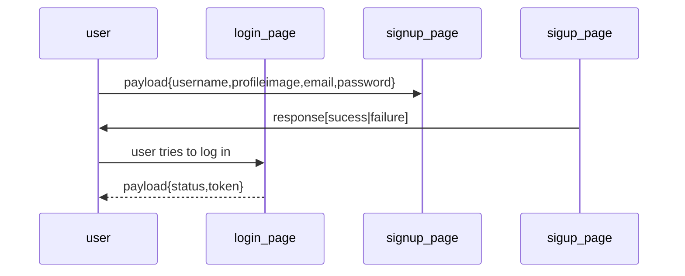

```mermaid
sequenceDiagram
    participant user
    participant login_page
    participant signup_page
    user ->> signup_page : payload{username,profileimage,email,password}
    sigup_page ->> user : response[sucess|failure]
    user ->>login_page : user tries to log in 
    login_page-->>user : payload{status,token}
```
